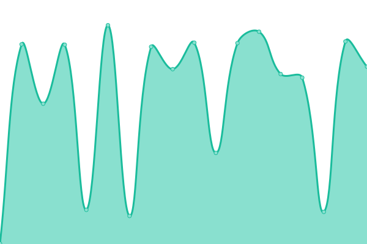
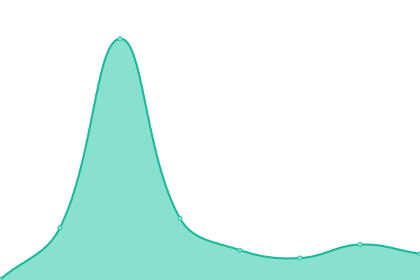
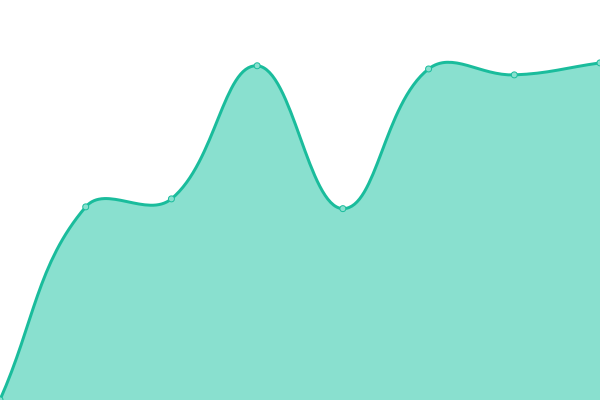

# [📈 Live Status](https://mystorycash.github.io/upptime): <!--live status--> **🟧 Partial outage**

This repository contains the open-source uptime monitor and status page for [superbullet](https://mystorycash.github.io/upptime), powered by [Upptime](https://github.com/upptime/upptime).

With [Upptime](https://upptime.js.org), you can get your own unlimited and free uptime monitor and status page, powered entirely by a GitHub repository. We use [Issues](https://github.com/mystorycash/upptime/issues) as incident reports, [Actions](https://github.com/mystorycash/upptime/actions) as uptime monitors, and [Pages](https://mystorycash.github.io/upptime) for the status page.

<!--start: status pages-->
<!-- This summary is generated by Upptime (https://github.com/upptime/upptime) -->
<!-- Do not edit this manually, your changes will be overwritten -->
<!-- prettier-ignore -->
| URL | Status | History | Response Time | Uptime |
| --- | ------ | ------- | ------------- | ------ |
|  [Superbullet homepage](https://www.superbullet.co.kr/) | 🟩 Up | [superbullet-homepage.yml](https://github.com/mystorycash/upptime/commits/HEAD/history/superbullet-homepage.yml) | 

 3055ms
     
 | 

<a href="https://mystorycash.github.io/upptime/history/superbullet-homepage">99.32%</a>
    

|  [Salaryn](https://salaryn.com/) | 🟩 Up | [salaryn.yml](https://github.com/mystorycash/upptime/commits/HEAD/history/salaryn.yml) | 

 171ms
     
 | 

<a href="https://mystorycash.github.io/upptime/history/salaryn">52.74%</a>
    

|  [Labangmore](https://www.labangmore.com/) | 🟩 Up | [labangmore.yml](https://github.com/mystorycash/upptime/commits/HEAD/history/labangmore.yml) | 

 3812ms
     
 | 

<a href="https://mystorycash.github.io/upptime/history/labangmore">67.14%</a>
    

|  [Labangmore Admin](https://super.labangmore.com/) | 🟥 Down | [labangmore-admin.yml](https://github.com/mystorycash/upptime/commits/HEAD/history/labangmore-admin.yml) | 

 0ms
     
 | 

<a href="https://mystorycash.github.io/upptime/history/labangmore-admin">0.00%</a>
    

|  [Labangmore Api](https://api.labangmore.com/ex/v1/broadcasts?pag=1&perPage=2) | 🟥 Down | [labangmore-api.yml](https://github.com/mystorycash/upptime/commits/HEAD/history/labangmore-api.yml) | 

 0ms
     
 | 

<a href="https://mystorycash.github.io/upptime/history/labangmore-api">0.00%</a>
    

|  [Labangmore Api Test](https://api.labangmore.com/ex-test/v1/broadcasts?pag=1&perPage=2) | 🟥 Down | [labangmore-api-test.yml](https://github.com/mystorycash/upptime/commits/HEAD/history/labangmore-api-test.yml) | 

 0ms
     
 | 

<a href="https://mystorycash.github.io/upptime/history/labangmore-api-test">0.00%</a>
    

|  [Counterce Client](http://superbullet.iptime.org:51402/) | 🟥 Down | [counterce-client.yml](https://github.com/mystorycash/upptime/commits/HEAD/history/counterce-client.yml) | 

 0ms
     
 | 

<a href="https://mystorycash.github.io/upptime/history/counterce-client">0.00%</a>
    

<!--end: status pages-->

[**Visit our status website →**](https://mystorycash.github.io/upptime)

## 📄 License

- Powered by: [Upptime](https://github.com/upptime/upptime)
- Code: [MIT](./LICENSE) © [superbullet](https://mystorycash.github.io/upptime)
- Data in the `./history` directory: [Open Database License](https://opendatacommons.org/licenses/odbl/1-0/)
